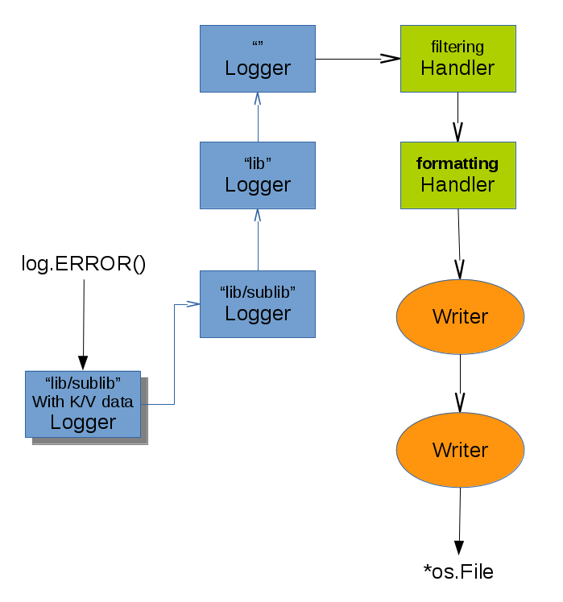

# gonelog

NOTICE: This repository is no longer maintained. Use http://github.com/One-com/gone "log".

Golang logging and metric library [](https://godoc.org/github.com/one-com/gonelog/log)

#### Logging

Package gonelog/log is a drop-in replacement for the standard Go logging library "log" which is fully source code compatible support all the standard library API while at the same time offering advanced logging features through an extended API.

The design goals of gonelog was:

* Standard library source level compatibility with mostly preserved behavior.
* Leveled logging with syslog levels.
* Structured key/value logging
* Hierarchical context-able logging to have k/v data in context logged automatically.
* Low resource usage to allow more (debug) log-statements even if they don't result in output.
* Light syntax to encourage logging on INFO/DEBUG level. (and low cost of doing so)
* Flexibility in how log events are output.
* A fast simple lightweight default in systemd new-daemon style only outputting <level>message to standard output.

See the examples in api_test.go

#### Metrics

Package gonelog/metric is a library for doing application metrics, primarily aimed at sending data to a statsd server. It supports gauges/counters/timers/histograms/sets in as lightweight a way as possible. A timer uses a mostly lockfree FIFO ringbuffer to take as few mutexes as possible even in parallel access. A gauge is simply an atomically maintained value, only sampled and exported once every flush interval, making the library very fast and usable in hot paths.

Please read the README in the metric folder.

## Logging Overview

Logging is done through *log.Logger objects. They implement all the logging API.



Every Logger has its own config, which determines the max log level for which it will generate log events. Whether an event will be generated is determined by the exact Logger on which a log method was called.

A Logger can have associated a Handler - but need not to.

Logger objects can be named, in which case they are participate in a global hierarchy. This hierarchy is traversed for a log event until a Logger with a Handler is found. The event is then passed to that Handler.

The event is then passed along a chain of Handler objects which determines whether and how the event will be logged. Handlers can be any object implementing the Handler interface.

Normally the Handler chain ends i a "Formatting" Handler - a Handler which converts the log event to a log-line. The log line can then be passed to a chain of Writers, which again can do filtering and other decisions. In the end a Writer will Write() the log line to an *os.File.

Handler chains need not end in Formatters and Writers. A Handler could easily be written which just (say) was a statsd network client.

On every Logger (named or not) you can call With() to get a "child" Logger which stores key/value context data to be logged with every log event. Such Loggers always have the same name as their parent. They are just a shorthand to not write all key/value context with every log statement.

## Example

The library is 100% source code compatible with the standard library logger

```go
    import "github.com/One-com/gonelog/log"

    log.Println("Hello log")

    mylog := log.New(os.Stdout,"PFX:",log.LstdFlags)
    mylog.Fatal("Arggh")
```

... at the same time as providing several extra features:

```go
h := log.NewStdFormatter(os.Stdout,"",log.LstdFlags|log.Llevel|log.Lpid|log.Lshortfile)
l := log.NewLogger(syslog.LOG_WARN,h)

err := DangerousOperation()
if err != nil {
	l.ERROR("An error happened", "err", err)
}

context_logger := l.With("session", session-id)

context_logger.WARN("Session will expire soon")

```

Plese see the Godoc documentation

